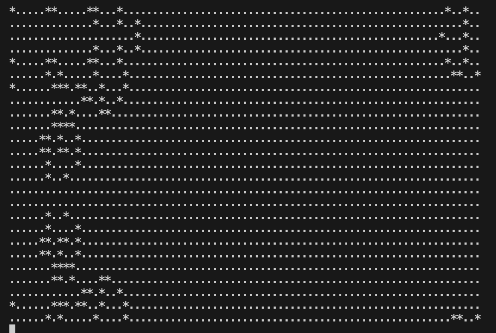

# game-of-life

Клеточный автомат, придуманный английским математиком Джоном Конвеем в 1970 году.

Запуск приложения: gcc game_of_life.c
                   ./a.out Название тестового файла

                   
